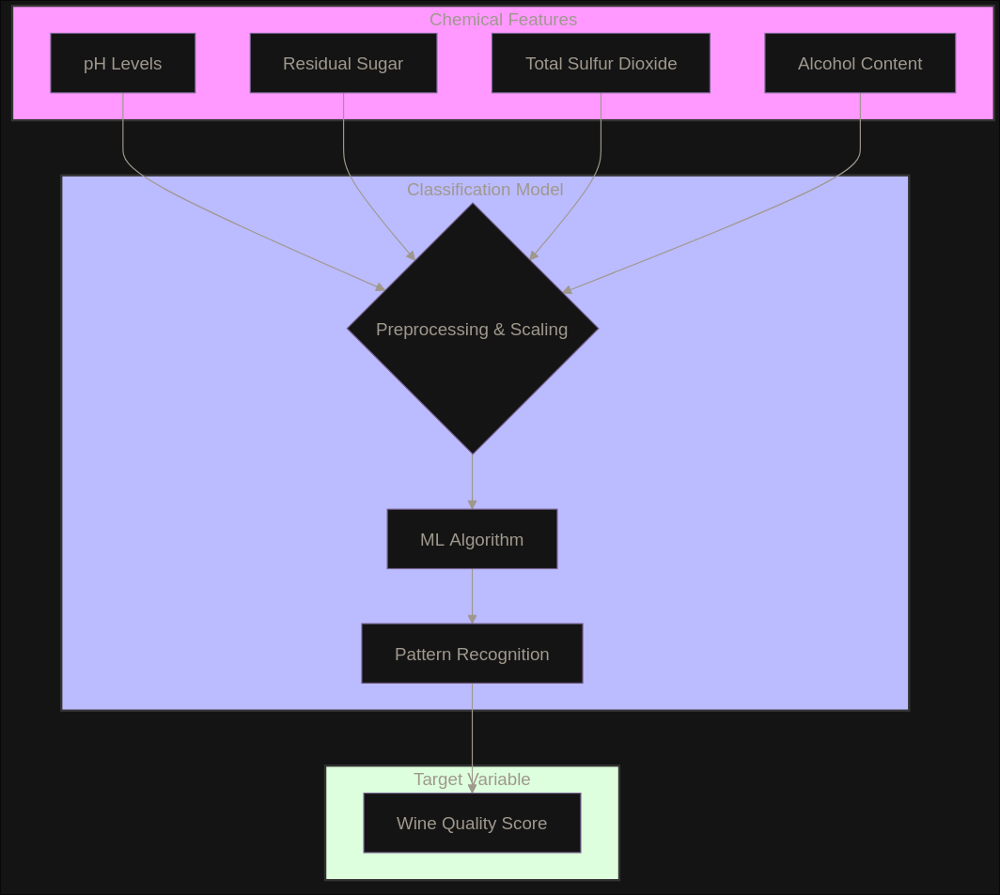

This is a classification model which attempts to output the quality of a wine product based on it's pH levels, residual sugar, total sulfur dioxide, and alcohol levels.
The dataset used, alongside credits, can be found in the 'wine+quality' directory.

### Diagram

